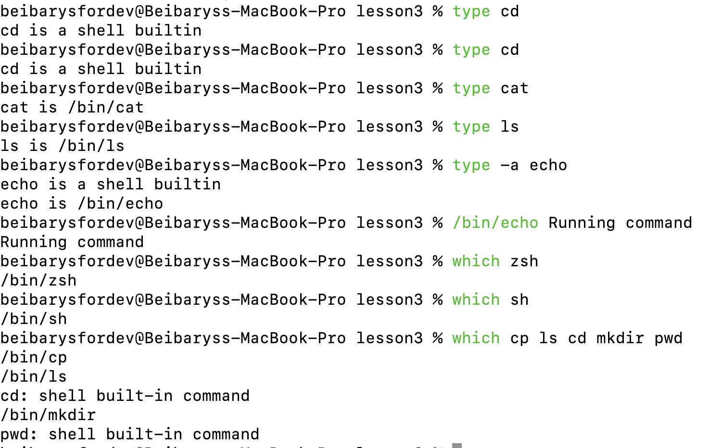
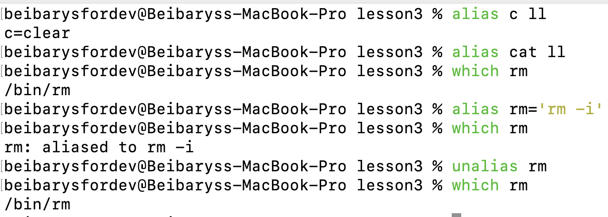

# Introduction to Bash

## Commands & Arguments

shell expansion
arguments

### bash
`bash` is a CLI or shell used on most Linux systems.

`bash` has features from:
1. sh 
2. csh 
3. ksh


### echo

```bash
echo Kazakhstan
Kazakhstan
echo Join the Unicorn Game
Join the Unicorn Game
```

main goal of `echo` is to echo the input it receives.


### Example 1. Practice with Echo


### commands

Some commands can be:
1. external - programs that has own binary in system and located in `/bin` or `/sbin`
2. builtin - part of shell itself

### Example 2. Practice with commands




## alias

Bash aliases allows you to do a mapping between a command and other. They allow to shorten long commands. Most shells like Zsh and Bash support bash aliases.

Link from https://medium.com/@jogarcia/bash-aliases-32f648e3a924

### Example 3. Alias sample

```bash
cat count.txt 
one
two
three
alias dog=cat
dog count.txt 
one
two
three
```

Further we will use for making Kubernetes aliases
https://kubernetes.io/docs/reference/kubectl/


You can undo an alias with the `unalias` command.




## Control operators

related parameters ($?)
and similar special characters &


1. $? determines the exit status of the executed command